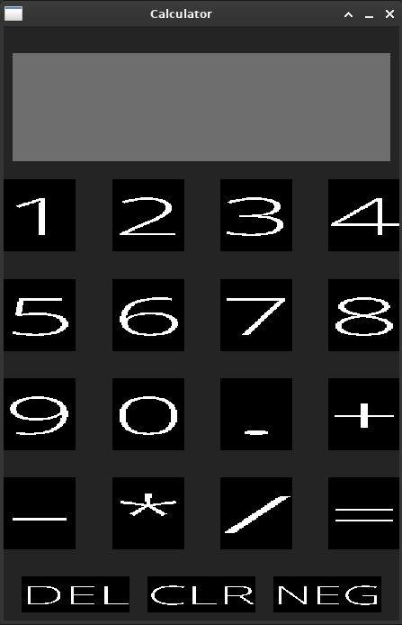

# **Calculator Project**


A minimal calculator written in C++




## Build Requirements
* A C++17 or newer compiler 
* Windows: Install MinGW as the compiler
* Linux/macOS: Ensure g++ is installed
* make must be installed for building

### On linux to have the nessesary SDL2 libraries(debian based)
run in terminal
```
sudo apt update
sudo apt upgrade
sudo apt install libsdl2-dev libsdl2-ttf-dev
```

### With Make installed

```
make 
```
run generated executable

**cleanup, to get rid of executable and object files**

```
make clean 
```
### Additional information

All the dependecies are included, such as dynamically linked libraries and SDL2 source files