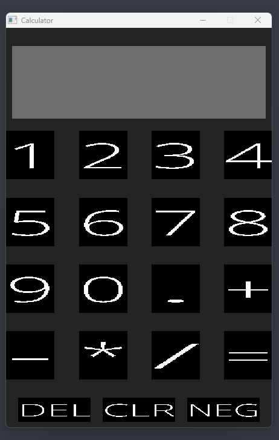

# **Calculator Project**


A minimal calculator to strengthen fundamentals




## Build Requirements
Have a C++ 17+ complier 

This project has been tested on windows, porting to other systems is being tested

Having make installed is very convenient but the project can still be ran without it

### Without Make installed(put into terminal)

```
g++ -Isdl/Include -I/usr/include/SDL2 -c src/Calculator.cpp -o Calculator.o
g++ -Isdl/Include -I/usr/include/SDL2 -c src/main.cpp -o main.o
g++ -Isdl/Include -Lsdl/lib main.o Calculator.o -o main.exe -lmingw32 -lSDL2main -lSDL2 -lSDL2_ttf
```
run generated executable

### With installed(put into terminal)

```
make 
```
run generated executable

**cleanup, to get rid of executable and object files**

```
make clean 
```
### Additional information

All the dependecies are included, such as dynamically linked libraries and SDL2 source files